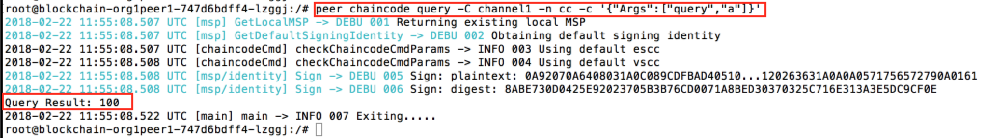
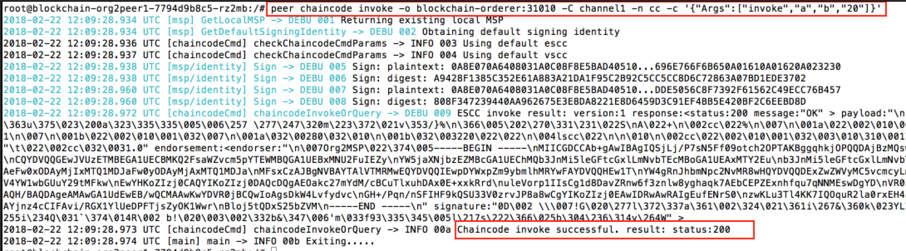
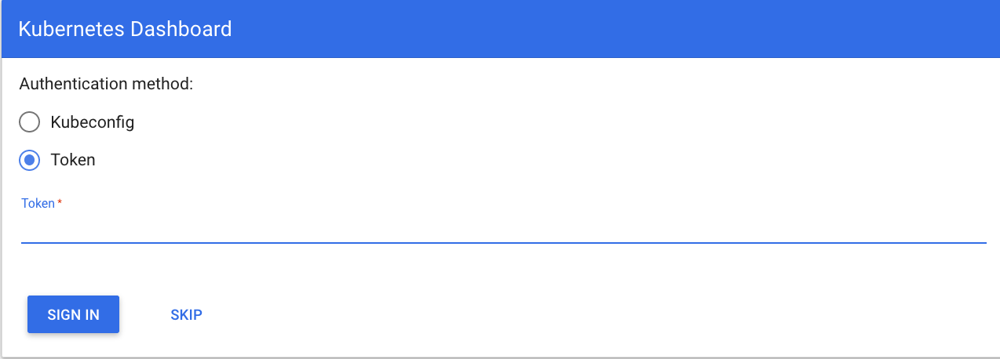
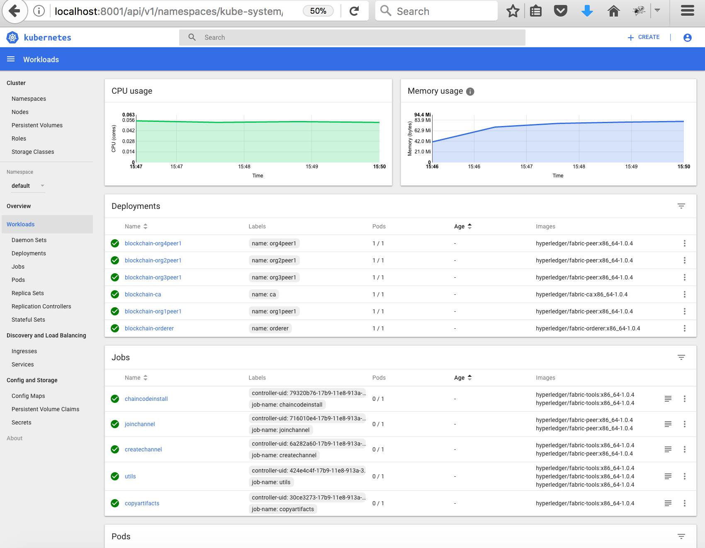

# Deploy the Blockchain network using Kubernetes APIs on Google Cloud

This code pattern demonstrates the steps involved in setting up your business network on **Hyperledger Fabric using Kubernetes APIs on google Cloud **. 

#### Kubernetes Cluster

Googlecloud allows you to create a free cluster that comes with 1 vCPUs, 4 GB memory, and 1 worker node. It allows you to get familiar with and test Kubernetes capabilities. However they lack capabilities like persistent NFS file-based storage with volumes.

To setup your cluster for maximum availability and capacity, Google Cloud allows you to create a fully customizable, production-ready cluster called _standard cluster_. _Standard clusters_ allow highly available cluster configurations such as a setup with two clusters that run in different regions, each with multiple worker nodes.

When the reader has completed this pattern, they will understand how to:

* modify configuration files according to their network topology
* deploy the hyperledger fabric network on Kubernetes cluster


## Kubernetes Concepts Used
* [Kubernetes Pods](https://kubernetes.io/docs/concepts/workloads/pods/pod/) - Pods represent the smallest deployable units in a Kubernetes cluster and are used to group containers that must be treated as a single unit.
* [Kubernetes Jobs](https://kubernetes.io/docs/concepts/workloads/controllers/jobs-run-to-completion/) - A job creates one or more pods and ensures that a specified number of them successfully terminate. As pods successfully complete, the job tracks the successful completions.
* [Kubernetes Deployment](https://kubernetes.io/docs/concepts/workloads/controllers/deployment/) - A deployment is a Kubernetes resource where you specify your containers and other Kubernetes resources that are required to run your app, such as persistent storage, services, or annotations.
* [Kubernetes Services](https://kubernetes.io/docs/concepts/services-networking/service/) - A Kubernetes service groups a set of pods and provides network connection to these pods for other services in the cluster without exposing the actual private IP address of each pod.
* [Kubernetes Persistent Volumes (PV)](https://kubernetes.io/docs/concepts/storage/persistent-volumes/) - PersistentVolumes are a way for users to *claim* durable storage such as NFS file storage.

## Steps

Follow these steps to setup and run this code pattern. 
Below URl for step byt step deployment of Kuberneyes on Google cloud platforme.
https://www.slideshare.net/AjeetSingh76/setup-kubernetes-with-flannel-on-ubuntu-platform-112420703

    
### 4. Deploy Hyperledger Fabric Network into Kubernetes Cluster

#### Understand the network topology

This pattern provides a script which automatically provisions a sample Hyperledger Fabric network consisting of four organizations, each maintaining one peer node, and a 'solo' ordering service. Also, the script creates a channel named as `channel1`, joins all peers to the channel `channel1`, install chaincode on all peers and instantiate chaincode on channel. The pattern also helps to drive execution of transactions against the deployed chaincode.

Navigate to the source directory
  ```
  $ cd blockchainfabric1.2
  $ ls
  ```
In the source directory, 
  * `configFiles` contains Kubernetes configuration files
  * `artifacts` contains the network configuration files
  * `*.sh` scripts to deploy and delete the network
  
#### Modify the Kubernetes configuration scripts

If there is any change in network topology, need to modify the configuration files (.yaml files) appropriately. The configuration files are located in `artifacts` and `configFiles` directory. For example, if you decide to increase/decrease the capacity of persistant volume then you need to modify `createVolume.yaml`.  

#### Run the script to deploy your Hyperledger Fabric Network

Once you have completed the changes (if any) in configuration files, you are ready to deploy your network. Execute the script to deploy your hyperledger fabric network.

  ```
  $ chmod +x setup_blockchainNetwork.sh
  $ ./setup_blockchainNetwork.sh
  ```

Note: Before running the script, please check your environment. You should able to run `kubectl commands` properly with your cluster as explained in step 3. 

#### Delete the network

If required, you can bring your hyperledger fabric network down using the script `deleteNetwork.sh`. This script will delete all your pods, jobs, deployments etc. from your Kubernetes cluster.

  ```
  $ chmod +x deleteNetwork.sh
  $ ./deleteNetwork.sh
  ```

### 5. Test the deployed network

After successful execution of the script `setup_blockchainNetwork.sh`, check the status of pods.

  ```
  $ kubectl get pods
  NAME                                    READY     STATUS    RESTARTS   AGE
  blockchain-ca-7848c48d64-2cxr5          1/1       Running   0          4m
  blockchain-orderer-596ccc458f-thdgn     1/1       Running   0          4m
  blockchain-org1peer1-747d6bdff4-4kzts   1/1       Running   0          4m
  blockchain-org2peer1-7794d9b8c5-sn2qf   1/1       Running   0          4m
  blockchain-org3peer1-59b6d99c45-dhtbp   1/1       Running   0          4m
  blockchain-org4peer1-6b6c99c45-wz9wm    1/1       Running   0          4m
  ```

As mentioned above, the script joins all peers on one channel `channel1`, install chaincode on all peers and instantiate chaincode on channel. It means we can execute an invoke/query command on any peer and the response should be same on all peers. Please note that in this pattern tls certs are disabled to avoid complexity. In this pattern, the CLI commands are used to test the network. For running a query against any peer, need to get into a bash shell of a peer, run the query and exit from the peer container.

Use the following command to get into a bash shell of a peer:

  ```
  $ kubectl exec -it <blockchain-org1peer1 pod name> bash
  ```

And the command to be used to exit from the peer container is:

  ```
  # exit
  ```

**Query**

Chaincode was instantiated with the values as `{ a: 100, b: 200 }`. Let’s query to `org1peer1` for the value of `a` to make sure the chaincode was properly instantiated.

  

**Invoke**

Now let’s submit a request to `org2peer1` to move 20 from `a` to `b`. A new transaction will be generated and upon successful completion of transaction, state will get updated.

  

**Query**

Let’s confirm that our previous invocation executed properly. We initialized the key `a` with a value of 100 and just removed 20 with our previous invocation. Therefore, a query against `a` should show 80 and a query against `b` should show 220. Now issue the query request to `org3peer1` and `org4peer1` as shown.

  
### 6. View the Kubernetes Dashboard

Obtain the token using the following command to authenticate for Kubernetes dashboard.

  ```
  $ kubectl config view -o jsonpath='{.users[0].user.auth-provider.config.id-token}'
  ```

Copy the token. Launch your Kubernetes dashboard with the default port 8001.

  ```
  $ kubectl proxy
  ```

Open the URL http://localhost:8001/ui in a web browser to see the Kubernetes dashboard. It will prompt for the authentication.

  

Provide the token and `SIGN-IN`. In the Workloads tab, you can see the resources that was created through scripts.

  

The hyperledger fabric network is ready to use. You can start developing your blockchain applications using node sdk or hyperledger composer for this deployed network.

## License

[Apache 2.0](LICENSE)
